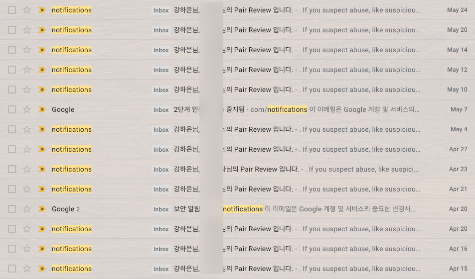
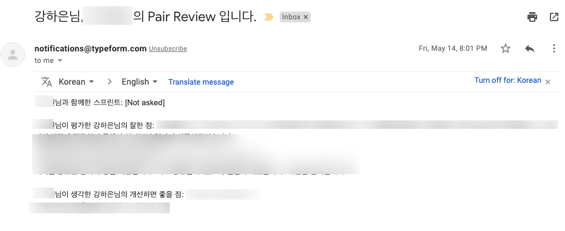
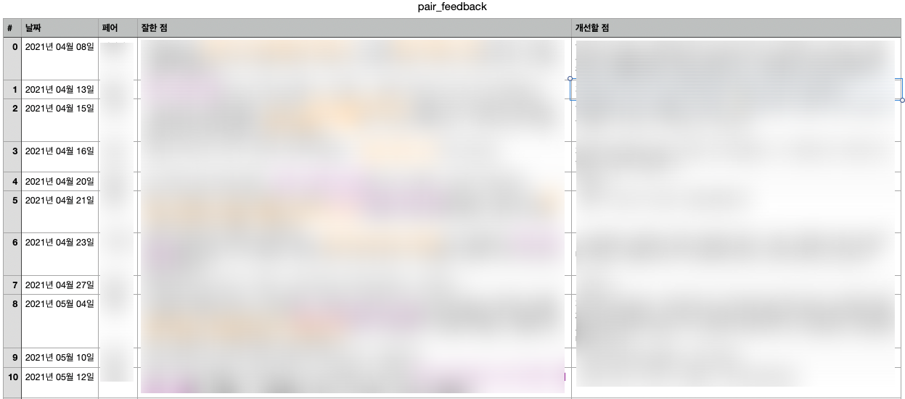

# PAIR REVIEW 메일 csv 파일로 저장하기: 

## 주요 기능:
- Codestates SEB 과정 수강생들의 Gmail 계정으로 발송되는 Pair Review 이메일 내용을 csv 파일로 저장합니다.

## Before & After 이미지
- Before: Gmail 계정에 누적되는 pair review 메일과 내용
<br>
<br>
- After: csv 파일 형태로 정리된 전체 pair review 메일



## 실행 전 안내사항
1. Gmail 계정 2단계 인증을 설정해주어야 합니다. 
	- 2단계 인증 설정하는 법: [Google 계정 고객센터](https://support.google.com/accounts/answer/185839?hl=ko)
2. 2단계 인증 설정 후, 앱 비밀번호를 생성해야 합니다. 
	- 앱 비밀번호를 생성하는 법: [Google 계정 고객센터](https://support.google.com/accounts/answer/185833?hl=ko)
3. mail.py 파일의 user, password 변수 설정을 위해서는 환경 변수를 지정해주어야 합니다. (mail.py 14, 15번 줄 참조) 다음과 같은 단계를 따라주시기 바랍니다.
	- `mail.py` 파일이 위치한 경로의 CLI 창에 `pip3 install python-dotenv` 실행 (또는 `pip install python-dotenv`)
	- 같은 경로에 `.env` 파일 생성
	- `.env` 파일 내 다음과 같은 변수 입력
	```python
	mail = 'kimcoding@gmail.com' # 본인 이메일 입력
	password = 'abcdefghijklmnop' # 본인 앱 비밀번호 입력 (16자리)
	```

### (Optional : 선택사항)
4. 현재는 접근하는 메일함이 "받은 편지함"(Inbox) 으로 설정되어 있으나, 다른 메일함으로도 변경 가능합니다. 변경을 원치 않는 경우 코드를 수정하지 않아도 됩니다.  
	- mail.py 22번 줄 참조 
	- 다른 메일함 선택 희망 시 Reference #4 참조


## 주의사항
- 계정의 전체 편지함(inbox)를 선택할 경우, 메일 데이터의 규모에 따라 실행 속도가 더딜 수 있습니다. 
- Python version 2.x 로 실행 시 mail.py의 한글 주석을 제대로 읽지 못하여 [에러](https://github.com/vodkamitlime/TIL-Today-I-Learned/blob/main/02-Python/00-Version-encoding.md)가 발생합니다. 따라서 Python version 3.x 를 다운받아 터미널에서 사용하는 python version을 3.x로 변경한 후 실행해야 합니다.
	- [How to set Python3 as a default python version on MacOS?](https://dev.to/malwarebo/how-to-set-python3-as-a-default-python-version-on-mac-4jjf)
	- [Ubuntu에서 Python 버전을 변경하는 방법](https://codechacha.com/ko/change-python-version/)
	- [Ubuntu Python 기본 실행 버전 설정/변경하기](https://ghostweb.tistory.com/803)
- 아래와 같은 에러가 뜨는 경우, [구글 계정의 IMAP 액세스를 허용](https://support.google.com/mail/answer/7126229?hl=ko)해 주어야 합니다. 
```python
'''
[ALERT] Your account is not enabled for IMAP use.
Please visit your Gmail settings page and enable your account for IMAP access.
(Failure)
'''
```


### Reference:
1. [How to Read Emails in Python](https://www.thepythoncode.com/article/reading-emails-in-python)
2. [Python imaplib 을 통한 Gmail 읽기](https://its2eg.tistory.com/entry/Python-imaplib%EC%9D%84-%ED%86%B5%ED%95%9C-Gmail-%EC%9D%BD%EA%B8%B0)
3. [Fetch & Convert Email in Python Programming](https://www.youtube.com/watch?v=bbPwv0TP2UQ&t=554s&ab_channel=PythonCodex)
4. [IMAP Extensions](https://developers.google.com/gmail/imap/imap-extensions)
5. [다른 이메일 플랫폼을 통해 Gmail 확인하기](https://support.google.com/mail/answer/7126229?hl=ko#zippy=%2C%EC%9D%B4%EB%A9%94%EC%9D%BC-%ED%81%B4%EB%9D%BC%EC%9D%B4%EC%96%B8%ED%8A%B8%EC%97%90-%EB%A1%9C%EA%B7%B8%EC%9D%B8%ED%95%A0-%EC%88%98-%EC%97%86%EC%9D%8C)

### Footnotes : 작업중인 부가기능
- Optimize date's timezone (Current: utc / Expected: kst)
- Update file automatically when new mail arrives